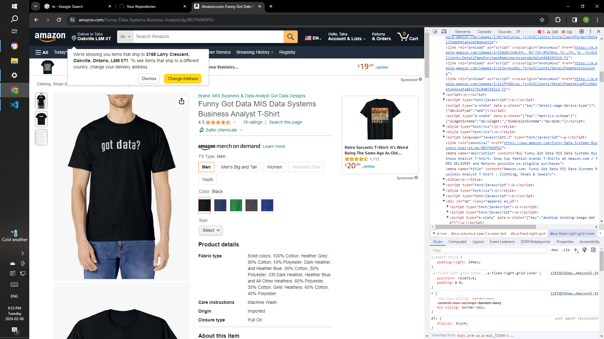

# PROJECT IS CURRENTLY UNDER DEVELOPEMENT

* SQLite3 Database
* Batch File Scripting
* Object Oreinted Programming (that's a given)
* Data-Classes
* .gitignore
* BeautifulSoup4 Web Scraping
* Logging via Python's loggin module
* 'grep' linux command
* User-defined Exceptions

